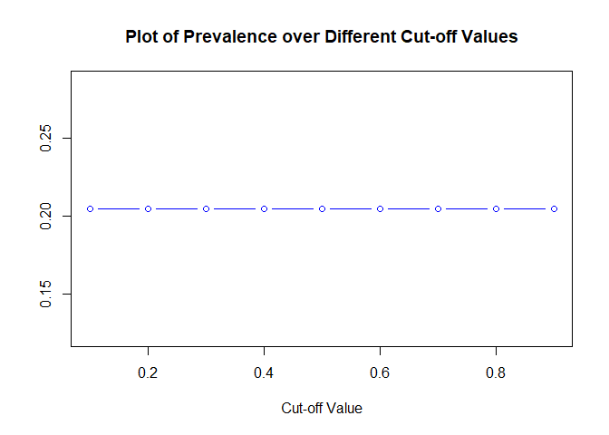
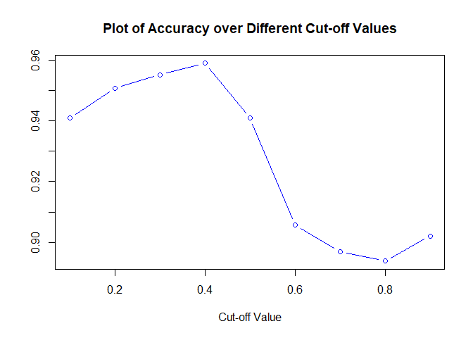
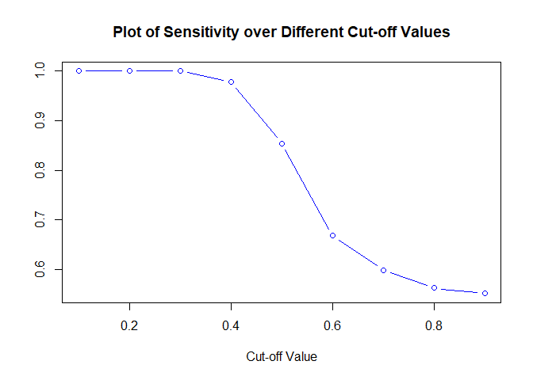
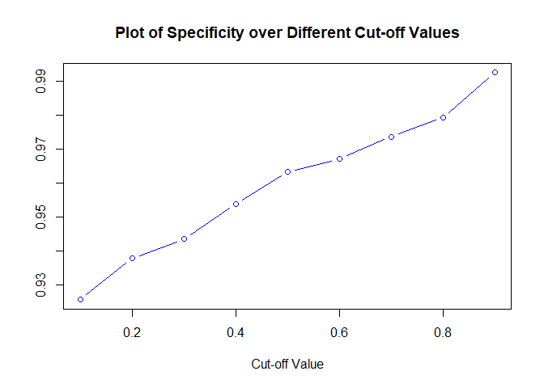
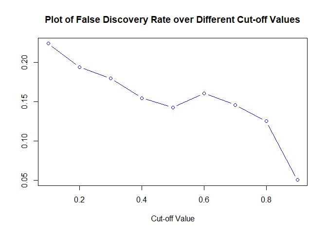
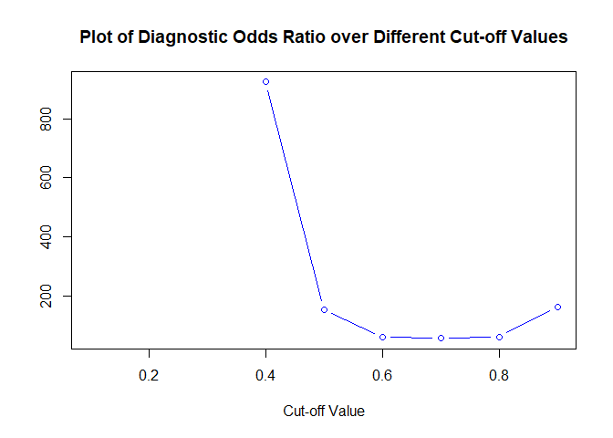

# **How lrpackage works**

**Authors**: Yingshan Qiu, Shakiru Oluwasanjo Oyeniran, Sk Nafiz Rahaman

**To open the help document, please write `?beta_ls` in the consol**

## Defining the package

``` r
library(lrpackage)
```

## Data Pre-Processing

**Reading and Initial Display:** The package begins by reading a dataset
(such as “expenses.csv”) and displaying its initial few rows. This
dataset includes personal information such as age, sex, BMI, number of
children, residential area, and medical costs, alongside smoking status.

``` r
data <- read.csv(file = "expenses.csv", header = TRUE)
head(data)
```

    ##   age    sex    bmi children smoker    region   charges
    ## 1  19 female 27.900        0    yes southwest 16884.924
    ## 2  18   male 33.770        1     no southeast  1725.552
    ## 3  28   male 33.000        3     no southeast  4449.462
    ## 4  33   male 22.705        0     no northwest 21984.471
    ## 5  32   male 28.880        0     no northwest  3866.855
    ## 6  31 female 25.740        0     no southeast  3756.622

**Data Transformation:** The data is then transformed into a numeric
matrix, essential for subsequent analysis. This involves converting
categorical variables (like sex and region) into binary numeric formats.
The transformed data is then structured into predictor matrix X and
response vector y.

``` r
data <- read.csv(file = "expenses.csv", header = TRUE)
data$sex <- ifelse(data$sex=="male",1,0)
data$smoker <- ifelse(data$smoker=="yes",1,0)
data$regionnortheast <- ifelse(data$region=="northeast",1,0)
data$regionnorthwest <- ifelse(data$region=="northwest",1,0)
data$regionsoutheast <- ifelse(data$region=="southeast",1,0)
x <- as.matrix(data[,c(1:4,7:10)])
X <- cbind(rep(1,nrow(x)),x)
y <- as.matrix(data[,5])
```

## Logistic Regression

The formula of losgistic regression based on response variable y and
predictor variables $X_1$, $X_2$, … $X_k$ is

$$
\hat{y} = \frac{1}{1+e^{-(\beta_0+\beta_1x_1+\cdots+\beta_kx_k)}}=\frac{1}{1+e^{-x^T\beta}}
$$ The best estimator of the coefficient vector $\beta$ is computed with
the least value of loss function of logistic regression, and the
numerical optimization process is shown in the following:

$$
\hat{\beta}=\mathop{\arg\min}\limits_{\beta}\sum_{i=1}^n (-y_i\cdot \text{ln}(p_i)-(1-y_i)\cdot \text{ln}(1-p_i))
$$ where $$
pi=\frac{1}{1+\text{exp}(-x_i^T\beta)},
$$ and $y_i$ and $x_i$ represent the ith observation and row of the
response and the predictors respectively.

#### Initial values for optimization

In order to start an optimization process, the package defines a initial
value of coefficient matrix. In order to get the estimator more
accurately, the package uses the least-square estimator as the initial
matrix of coefficient.

``` r
beta1 <- solve(t(X)%*%X)%*%t(X)%*%y
```

Then, the package constructs a function of loss value. The function name
would be `loss_func_lr`:

``` r
loss_func_lr <- function(beta,predictor,response){
  pi <- 1/(1+exp(-predictor%*%beta))
  loss <- sum(-response*log(pi)-(1-response)*log(1-pi))
  return(loss)
}
```

``` r
loss_init <- loss_func_lr(beta=beta1, predictor=X,response=y)
```

Now,the package creates a function to get a estimate for coefficients.
The function name would be `beta_ls`:

``` r
beta_ls <- function(predictor, response){
  par <- optim(beta1, loss_func_lr, predictor=predictor, response=response)$par
  loss <- loss_func_lr(par,predictor=X,response=y)
  output <- list(coefficient=par, loss=loss)
  return(output)
}
```

``` r
optim_beta <- beta_ls(predictor=X,response=y)
optim_beta
```

    ## $coefficient
    ##                          [,1]
    ##                  0.6031355407
    ## age             -0.0697028208
    ## sex             -0.0257685364
    ## bmi             -0.1777873233
    ## children        -0.2536533153
    ## charges          0.0003379421
    ## regionnortheast  0.1897068715
    ## regionnorthwest -0.0841624978
    ## regionsoutheast  0.2547669186
    ## 
    ## $loss
    ## [1] 167.9594

#### Bootstrap Confidence Interval

The package includes a bootstrap function to estimate the variability
and confidence intervals of the model coefficients, thereby enhancing
the robustness of the analysis.

``` r
bootstrap_lr <- function(data, predictor_columns, response_column, num_bootstraps = 20) {
  # Determine the number of predictors (including intercept)
  num_predictors <- length(predictor_columns) + 1
  
  # Initialize a matrix to store the coefficients for each bootstrap sample
  coefficients <- matrix(NA, nrow = num_bootstraps, ncol = num_predictors)

  for (i in 1:num_bootstraps) {
    # Resample the data
    sample_indices <- sample(1:nrow(data), replace = TRUE)
    sample_data <- data[sample_indices, ]

    # Fit the logistic regression model
    formula <- as.formula(paste(response_column, "~", paste(predictor_columns, collapse = "+")))
    fitted_model <- glm(formula, data = sample_data, family = "binomial")

    # Store the coefficients
    # Use `coef` function to extract coefficients and align with matrix dimensions
    model_coefficients <- coef(fitted_model)
    coefficients[i, 1:length(model_coefficients)] <- model_coefficients
  }
  
  return(coefficients)
}
```

#### Drawing a fitted plot of logistic regression

The package uses a function which would draw the fitted logistic curve
to the responses. The y-axis is the binary response y. The x-axis
represents a sequence of values from the range of fitted value
$\hat{y}= x^T \beta$.

``` r
plot_logistic_curve <- function(X, beta_optim, y) {
    # Calculate Xβ values
    X_beta_values <- X %*% beta_optim

    # Generate a sequence for plotting
    seq_X_beta <- seq(min(X_beta_values), max(X_beta_values), length.out = 100)

    # Calculate predicted probabilities using the logistic function
    predicted_probabilities <- 1 / (1 + exp(-seq_X_beta))

    # Plot the curve
    plot(seq_X_beta, predicted_probabilities, type = "l", col = "blue",
         xlab = "Xβ", ylab = "Predicted Probability",
         main = "Fitted Logistic Curve")
    points(X_beta_values, y, col = "red")
}
```

## Confusion Matrix

Confusion matrix is a specific table layout that allows visualization of
the performance of an algorithm. Each column of the matrix represents
the instances in an actual class while each row represents the instances
in a predicted class.

The template for any binary confusion matrix uses the four kinds of
results (true positives, false negatives, false positives, and true
negatives) along with the positive and negative classifications. The
four outcomes can be formulated in a confusion matrix, as follows:

| Total                   | Actual Positive (P) | Actual Negative (N) |
|-------------------------|---------------------|---------------------|
| Predicted Positive (PP) | True Positive (TP)  | False Positive (FP) |
| Predicted Negative (PN) | False Negative (FN) | True Negative (TN)  |

Based on the confusion matrix, we can compute the following metrics: $$
\begin{align}
&\text{Prevalence}=\frac{\text{P}}{\text{P}+\text{N}}\\
&\text{Accuracy (ACC)}=\frac{\text{TP}+\text{TN}}{\text{P}+\text{N}}=\frac{\text{TP}+\text{TN}}{\text{TP}+\text{TN}+\text{FP}+\text{FN}}\\
&\text{Sensitivity (TPR)}=\frac{\text{TP}}{\text{P}}=\frac{\text{TP}}{\text{TP}+\text{FN}}\\
&\text{Specificity (TNR)}=\frac{\text{TN}}{\text{N}}=\frac{\text{TN}}{\text{TN}+\text{FP}}\\
&\text{False Discovery Rate (FDR)}=\frac{\text{FP}}{\text{FP}+\text{TP}}\\
&\text{Diagnostic Odds Ratio (DOR)}=\frac{\text{LR}_+}{\text{LR}_-}=\frac{\text{TPR}/\text{FPR}}{\text{FNR}/\text{TNR}}
\end{align}
$$

#### Generating the confusion matrix of logistic regression and plotting

**Confusion Matrix:** The package provides functionality to calculate a
confusion matrix, which is crucial for evaluating the performance of the
logistic regression model.

**Performance Metrics:** It computes various performance metrics such as
accuracy, sensitivity, specificity, false discovery rate, and diagnostic
odds ratio from the confusion matrix.

**Probabilities and Cutoff Analysis:** Additional functions compute
predicted probabilities and perform analyses based on different cutoff
values, allowing for a nuanced understanding of model performance.

**Visualization of Metrics:** The package also includes functionality to
plot these metrics across a range of cutoff values, offering a visual
representation of model performance under different classification
thresholds.

``` r
 # Calculate predicted probabilities
pred_prob_ls <- function(predictor, response) {
  optim_beta <- beta_ls(predictor,response)
  beta_optim <- optim_beta$coefficient
  predicted_probabilities <- 1 / (1 + exp(-predictor %*% beta_optim))
  predicted_classes <- ifelse(predicted_probabilities > 0.5, 1, 0)
  output <- list(prob=predicted_probabilities,class=predicted_classes)
  return(output)
}

# Calculate the confusion martrix
ls_confusion <- function(predictor, response){
  predicted_probabilities <- pred_prob_ls(predictor,response)$prob
  predicted_classes <- pred_prob_ls(predictor,response)$class
  
  # Create Confusion Matrix
  conf_matrix <- table(Predicted = predicted_classes, Actual = response)
  
  # Calculate metrics
  prevalence <- mean(response)
  accuracy <- sum(diag(conf_matrix)) / sum(conf_matrix)
  sensitivity <- conf_matrix[2, 2] / sum(conf_matrix[, 2])
  specificity <- conf_matrix[1, 1] / sum(conf_matrix[, 1])
  false_discovery_rate <- conf_matrix[2, 1] / sum(conf_matrix[2, ])
  diagnostic_odds_ratio <- (conf_matrix[2, 2] * conf_matrix[1, 1]) / (conf_matrix[1, 2] * conf_matrix[2, 1])

  # Output
  list(ConfusionMatrix = conf_matrix,
       Prevalence = prevalence,
       Accuracy = accuracy,
       Sensitivity = sensitivity,
       Specificity = specificity,
       FalseDiscoveryRate = false_discovery_rate,
       DiagnosticOddsRatio = diagnostic_odds_ratio
    )
}
```

``` r
#Compute the confusion matrix of logistic regression with the cut-off value 0.5
ls_confusion(predictor = X, response = y)
```

    ## $ConfusionMatrix
    ##          Actual
    ## Predicted    0    1
    ##         0 1025   40
    ##         1   39  234
    ## 
    ## $Prevalence
    ## [1] 0.2047833
    ## 
    ## $Accuracy
    ## [1] 0.9409567
    ## 
    ## $Sensitivity
    ## [1] 0.8540146
    ## 
    ## $Specificity
    ## [1] 0.9633459
    ## 
    ## $FalseDiscoveryRate
    ## [1] 0.1428571
    ## 
    ## $DiagnosticOddsRatio
    ## [1] 153.75

##### Plots of any of metrics based on different cut-off values from 0.1 to 0.9 with steps of 0.1

``` r
pred_prob_ls2 <- function(predictor, response, cutoff_value) {
  optim_beta <- beta_ls(predictor,response)
  beta_optim <- optim_beta$coefficient
  predicted_probabilities <- 1 / (1 + exp(-predictor %*% beta_optim))
  predicted_classes <- ifelse(predicted_probabilities > cutoff_value, 1, 0)
  output <- list(prob=predicted_probabilities,class=predicted_classes)
  return(output)
}

# Function to calculate metrics for a given cut-off value
calculate_metrics2 <- function(predictor, response, cutoff_value) {
  predicted_probabilities <- pred_prob_ls2(predictor, response, cutoff_value)$prob
  predicted_classes <- pred_prob_ls2(predictor, response, cutoff_value)$class
  
  conf_matrix <- table(Predicted = predicted_classes, Actual = response)
        
  # Calculate various metrics
  prevalence <- mean(y)
  accuracy <- sum(diag(conf_matrix)) / sum(conf_matrix)
  sensitivity <- conf_matrix[2, 2] / sum(conf_matrix[, 2])
  specificity <- conf_matrix[1, 1] / sum(conf_matrix[, 1])
  false_discovery_rate <- conf_matrix[2, 1] / sum(conf_matrix[2, ])
  diagnostic_odds_ratio <- (conf_matrix[2, 2] * conf_matrix[1, 1]) / (conf_matrix[1, 2] * conf_matrix[2, 1])

  # Output
  output <- list(conf_matrix=conf_matrix,
                 prevalence=prevalence,
                 accuracy=accuracy,
                 sensitivity=sensitivity,
                 specificity=specificity,
                 false_discovery_rate=false_discovery_rate,
                 diagnostic_odds_ratio=diagnostic_odds_ratio)
  return(output)
}

compute_and_plot_logistic_metrics <- function(predictor, response, typeofmetric, plot_metric = NULL){
  cutoff_values <- seq(0.1, 0.9, by = 0.1)
  metric <- rep(0, length(cutoff_values))
  name <- c("Prevalence", "Accuracy", "Sensitivity", "Specificity", "False Discovery Rate", "Diagnostic Odds Ratio")
  if (!(typeofmetric %in% name)) {
    stop("Invalid metric name. Choose from Prevalence, Accuracy, Sensitivity, Specificity, False Discovery Rate, Diagnostic Odds Ratio.")}else{
      for (i in 1:length(cutoff_values)){
      number <- which(typeofmetric==name)+1
      metric[i] <- calculate_metrics2(predictor, response, cutoff_value=cutoff_values[i])[[number]]
      }
    plot(cutoff_values, metric, type = "b", col = "blue", 
         xlab="Cut-off Value", ylab="", main=paste("Plot of",typeofmetric,"over Different Cut-off Values", sep = " "))
  }
}
```

``` r
for (i in c(1:6)){
  name <- c("Prevalence", "Accuracy", "Sensitivity", "Specificity", "False Discovery Rate", "Diagnostic Odds Ratio")
  compute_and_plot_logistic_metrics(predictor=X, response=y, typeofmetric=name[i], plot_metric = NULL)
}
```

<!-- --><!-- --><!-- --><!-- --><!-- --><!-- -->
